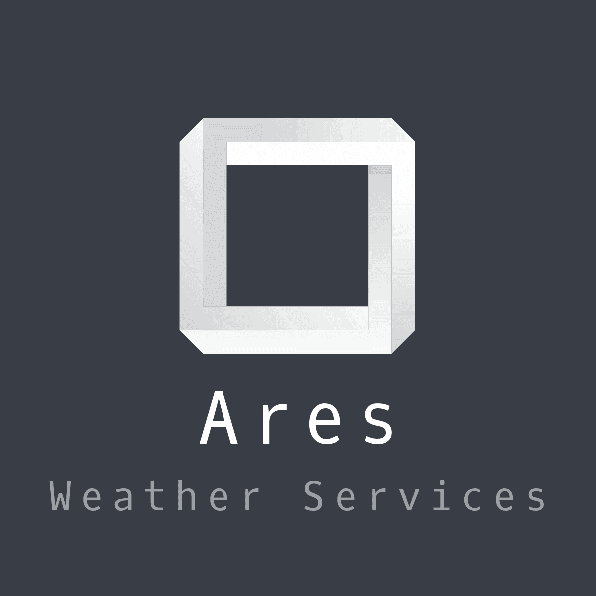
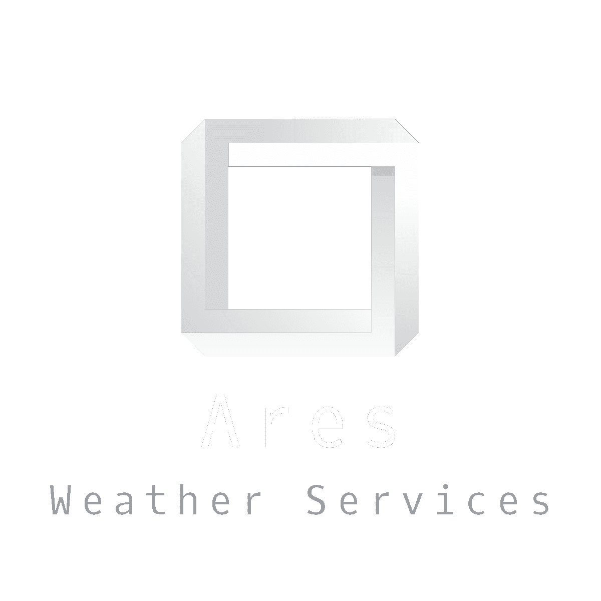

<!-- Improved compatibility of back to top link: See: https://github.com/othneildrew/Best-README-Template/pull/73 -->
<a name="readme-top"></a>
<!--
*** Thanks for checking out the Best-README-Template. If you have a suggestion
*** that would make this better, please fork the repo and create a pull request
*** or simply open an issue with the tag "enhancement".
*** Don't forget to give the project a star!
*** Thanks again! Now go create something AMAZING! :D
-->


<!-- PROJECT SHIELDS -->
<!--
*** I'm using markdown "reference style" links for readability.
*** Reference links are enclosed in brackets [ ] instead of parentheses ( ).
*** See the bottom of this document for the declaration of the reference variables
*** for contributors-url, forks-url, etc. This is an optional, concise syntax you may use.
*** https://www.markdownguide.org/basic-syntax/#reference-style-links
-->


<!-- PROJECT LOGO -->
<br />
<div align="center">
  <a href="https://github.com/gerardocipriano/ares">
    
  </a>

<h3 align="center">Ares - Weather Services</h3>

  <p align="center">
    Integrated solution for temperature and humidity field collection
    <br />
    <a href="https://github.com/gerardocipriano/ares"><strong>Explore the docs »</strong></a>
    <br />
    <br />
    <a href="https://ares3.netlify.app/">View Demo</a>
    ·
    <a href="https://github.com/gerardocipriano/ares/issues">Report Bug</a>
    ·
    <a href="https://github.com/gerardocipriano/ares/issues">Request Feature</a>
  </p>
</div>


<!-- TABLE OF CONTENTS -->
<details>
  <summary>Table of Contents</summary>
  <ol>
    <li>
      <a href="#about-the-project">About The Project</a>
      <ul>
        <li><a href="#built-with">Built With</a></li>
      </ul>
    </li>
    <li>
      <a href="#getting-started">Getting Started</a>
      <ul>
        <li><a href="#prerequisites">Prerequisites</a></li>
        <li><a href="#installation">Installation</a></li>
      </ul>
    </li>
    <li><a href="#usage">Usage</a></li>
    <li><a href="#roadmap">Roadmap</a></li>
    <li><a href="#contributing">Contributing</a></li>
    <li><a href="#license">License</a></li>
    <li><a href="#contact">Contact</a></li>
  </ol>
</details>


<!-- ABOUT THE PROJECT -->
## About The Project
<br />
<div align="center">
  <a href="https://github.com/gerardocipriano/ares">
    
  </a>
  <p align="center">
</div>

The goal of the project is to develop a software/hardware solution for field temperature and humidity collection. To sample the data we use an arduino module equipped with an ethernet shield. Arduino is therefore able to send the collected data via network cable. The measurements are sent to an online mysql database. A webserver accesses the measurements from the database and allows the customer to view them through an accessible and user friendly web portal.

<p align="right">(<a href="#readme-top">back to top</a>)</p>


### Built With


* [![Vue][Vue.js]][Vue-url]
* [![Bootstrap][Bootstrap.com]][Bootstrap-url]

<p align="right">(<a href="#readme-top">back to top</a>)</p>


<!-- GETTING STARTED -->
## Getting Started

This is an example of how you may give instructions on setting up your project locally.
To get a local copy up and running follow these simple example steps.

### Prerequisites

  Hardware:
  1. Arduino Mega
  2. Ethernet Shield
  3. Ethernet Cable

  Software:
  1. Arduino IDE
  2. Node.js (for web portal)


### Installation

1. Clone the repository on your local machine
   ```sh
   git clone https://github.com/gerardocipriano/ares.git
   ```
2. On Arduino IDE, install the following libraries: https://github.com/256dpi/arduino-mqtt, https://github.com/ChuckBell/MySQL_Connector_Arduino
3. Make sure to adjust the IPs in the code, you should enter a valid IP for your network (right class, not taken) adn for your DB
4. Fill with your parameters the env.htemplate file, then rename it in env.h and import it in your sketch
5. Upload on Arduino the sketch named "ares_MQTT_customBuild_A1_API_env.ino"
6. Open the project folder with VSC
7. Install NPM packages
   ```sh
   npm install
   ```
8. Enter in the dev mode
   ```sh
   npm run dev
   ```

<p align="right">(<a href="#readme-top">back to top</a>)</p>


<!-- USAGE EXAMPLES -->
## Usage

Use this space to show useful examples of how a project can be used. Additional screenshots, code examples and demos work well in this space. You may also link to more resources.

_For more examples, please refer to the [Documentation](https://example.com)_

<p align="right">(<a href="#readme-top">back to top</a>)</p>


<!-- ROADMAP -->
## Roadmap

Mandatory features:
- [ ] Arduino Development
    - [x] Temperature and humidity sampling with arduino
    - [x] Network connection via ethernet shield
    - [x] Connection to MySQL DB
    - [x] Writing measurements on DB
    - [x] API /refresh for manual sending of data
    - [x] Sending notification status to MQTT

- [ ] Develop web portal
    - [x] Build HTML, CSS and JS
    - [x] Connection to MySQL DB
    - [x] Show measurements data


<p align="right">(<a href="#readme-top">back to top</a>)</p>


<!-- CONTACT -->
## Contact

Gerardo Cipriano - gerardo.cipriano@studio.unibo.it

Marawan Emad Ragab Abdelhamid Mohamed - marawan.emadragab@studio.unibo.it

Brayan Vaccaro - brayan.vaccaro@studio.unibo.it


Project Link: [https://github.com/gerardocipriano/ares](https://github.com/gerardocipriano/ares)

<p align="right">(<a href="#readme-top">back to top</a>)</p>


<!-- MARKDOWN LINKS & IMAGES -->
<!-- https://www.markdownguide.org/basic-syntax/#reference-style-links -->
[contributors-shield]: https://img.shields.io/github/contributors/gerardocipriano/repo_name.svg?style=for-the-badge
[contributors-url]: https://github.com/gerardocipriano/ares/graphs/contributors
[forks-shield]: https://img.shields.io/github/forks/gerardocipriano/repo_name.svg?style=for-the-badge
[forks-url]: https://github.com/gerardocipriano/ares/network/members
[stars-shield]: https://img.shields.io/github/stars/gerardocipriano/repo_name.svg?style=for-the-badge
[stars-url]: https://github.com/gerardocipriano/ares/stargazers
[issues-shield]: https://img.shields.io/github/issues/gerardocipriano/repo_name.svg?style=for-the-badge
[issues-url]: https://github.com/gerardocipriano/ares/issues
[license-shield]: https://img.shields.io/github/license/gerardocipriano/repo_name.svg?style=for-the-badge
[license-url]: https://github.com/gerardocipriano/ares/blob/master/LICENSE.txt
[linkedin-shield]: https://img.shields.io/badge/-LinkedIn-black.svg?style=for-the-badge&logo=linkedin&colorB=555
[linkedin-url]: https://linkedin.com/in/linkedin_username
[product-screenshot]: images/screenshot.png
[Next.js]: https://img.shields.io/badge/next.js-000000?style=for-the-badge&logo=nextdotjs&logoColor=white
[Next-url]: https://nextjs.org/
[React.js]: https://img.shields.io/badge/React-20232A?style=for-the-badge&logo=react&logoColor=61DAFB
[React-url]: https://reactjs.org/
[Vue.js]: https://img.shields.io/badge/Vue.js-35495E?style=for-the-badge&logo=vuedotjs&logoColor=4FC08D
[Vue-url]: https://vuejs.org/
[Angular.io]: https://img.shields.io/badge/Angular-DD0031?style=for-the-badge&logo=angular&logoColor=white
[Angular-url]: https://angular.io/
[Svelte.dev]: https://img.shields.io/badge/Svelte-4A4A55?style=for-the-badge&logo=svelte&logoColor=FF3E00
[Svelte-url]: https://svelte.dev/
[Laravel.com]: https://img.shields.io/badge/Laravel-FF2D20?style=for-the-badge&logo=laravel&logoColor=white
[Laravel-url]: https://laravel.com
[Bootstrap.com]: https://img.shields.io/badge/Bootstrap-563D7C?style=for-the-badge&logo=bootstrap&logoColor=white
[Bootstrap-url]: https://getbootstrap.com
[JQuery.com]: https://img.shields.io/badge/jQuery-0769AD?style=for-the-badge&logo=jquery&logoColor=white
[JQuery-url]: https://jquery.com 
