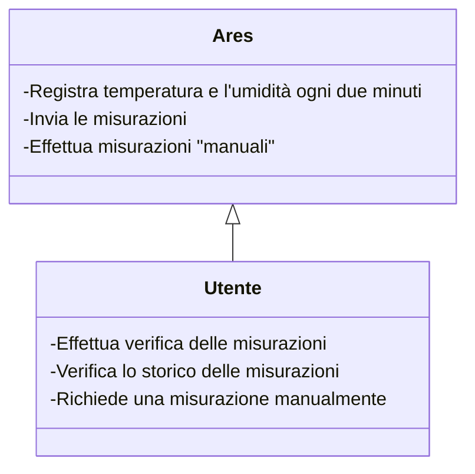

# Meta-relazione per LABORATORIO DI SISTEMI EMBEDDED E IOT

# Analisi

Il software "Ares" è commissionato da un' azienda che vende mangimi. Il cliente ha richiesto lo sviluppo di un sistema IoT per la registrazione della temperatura e dell'umidità all'interno dei locali elettrici situati nei magazzini di stoccaggio a Cesena e Modena.
Il sistema dovrebbe essere in grado di monitorare costantemente la temperatura (se ne vuole anche tenere memorizzato lo storico) e l'umidità all'interno dei siti di stoccaggio e inviare i dati raccolti a un'interfaccia web accessibile per la visualizzazione e l'analisi. 
Il cliente si aspetta che il sistema sia economico, facile da installare e configurare, e che sia in grado di funzionare in modo affidabile per un lungo periodo di tempo. 

## Requisiti

#### Requisiti funzionali
- Rilevamento temperatura ogni due minuti.
- Invio della temperatura e umidità ad un database.
- Invio della temperatura e umidità ad un broker MQTT.
- Il dispositivo è in ascolto di eventuali richieste di lettura manuale delle misure.
- Interfaccia Web.

## Analisi e modello del dominio

"Ares" dovrà interagire con gli utenti finali.
Gli utenti finali devono poter aver accesso allo storico di tutte le misurazioni, allo stato live del sistema dall'interfaccia web; Devono anche poter richiedere nuove misure al dispositivo onsite.
I dispositivi onsite devono essere collegati in rete, effettuare la loro misurazione ogni due minuti e inviarla al server/db.

Gli elementi costitutivi del problema sono sintetizzati nella seguente figura.

# Design

(In questo capitolo si spiegano le strategie messe in campo per
soddisfare i requisiti identificati nell'analisi.

Si parte da una visione architetturale, il cui scopo è informare il
lettore di quale sia il funzionamento dell'applicativo realizzato ad
alto livello.)

## Architettura

Il cliente richiede una soluzione economica, per cui si è scelto di usare Arduino.
Per il workload previsto, la scheda scelta è Arduino Mega.
Nelle cabine elettriche del cliente sono presenti switch; Arduino (equipaggiato con un ethernet shield w5100) verrà connesso alla rete collegandolo ad una porta libera.
Si è scelto di utilizzare un broker MQTT per mostrare le misurazioni più recenti "live".
Il parte web sarà realizzata con il metaframework Nuxt (v3).
Sia backend che frontend utilizzeranno Nuxt.
Lo stile verrà implementato con bootstrap. Si seguirà un approccio Mobile-first nelle fasi del suo sviluppo.
I dati delle verranno ospitati su un database MySql in cloud.
Avendo il database in cloud, il backend non avrà mai problemi nel reperire i dati dal DB.
Tutte le variabili sensibili, come indirizzi, hostname e credenziali, sono salvate in un file .env, non caricato su repository pubbliche, per garantire la confidenzialità dei dati trattati.

  

## Design dei componenti

In questa sezione approfondiremo i singoli componenti creati, le funzioni che erogano e le API che sfruttano.

#### Premessa: DB

Il Database è composto da solo 1 tabella.
1. Measurements: contiene timestamp, nome del dispositivo, posizione, temperatura e umidità.

Sono stati creati due utenti di servizio per interagire con il DB.
Le query di select del web server, vengono eseguite utilizzando un utente che ha solo i permessi di select sulle tabelle.
Le query che richiedono INSERT sono eseguite invece da un altro utente di servizio, con solo i privilegi di INSERT.

### Sketch Ino

Utilizzata architettura classica Hyper-Loop.
Lo sketch utilizza diverse librerie per Arduino, come Ethernet, SPI, MQTT e MySQL.
Le variabili più sensibili, sono contenute all'interno di un file separato "env.h". 
Quando le schede Arduino verranno installate onsite, bisognerà compilare il codice avendo cura di inserire i dati aggiornati all'interno del file env.h, l'IP della scheda e del DB andranno invece modificate direttamente sul codice, nel file .ino.
Arduino, è sempre in ascolto sulla porta 80 di una richiesta GET HTTP con la stringa "Refresh", quando lo riceve, manda le due misure.
Il broker MQTT scelto è Shiftr.io, il quale mette a disposizione gratuitamente un'istanza cloud la quale è visibile direttamente dal portale web.

### Web

#### Index

Nell'indice viene effettuata una query al DB per ottenere tutto lo storico delle misurazioni dei vari sensori.

#### Live

Nella pagina live è presente un frame messo a disposizione dal fornitore del servizio Broker MQTT.
Il frame permette di verificare la connessione ad internet dei device, e l'ultimo messaggio inviato con i valori di temperatura e umidità.

#### Refresh

Il tasto refresh presente nella navbar esegue una GET sull'ip utilizzando /refresh come risorsa richiesta.
Quando arduino riceve una GET con questa richiesta, forza la rilettura della misura.

# Sviluppo

## Testing automatizzato

Il testing avviene dopo l'aggiunta di ogni nuova funzione allo sketch, utilizzando il monitor seriale come debugger.
Anche dopo il commit, si verifica che la versione demo live su netlify riesca a compilare correttamente e a 
visualizzare le nuove features.

## Note di sviluppo

Per mancanza di tempo, alcuni requisiti non funzionali non sono stati implementati in questa versione del software.
La chiamata "refresh" al momento funziona solo in locale, bisognerà definire come esporre arduino tramite firewall aziendale e a quale porta utilizzare per mettersi in ascolto delle GET.
Il codice HTML è stato correttamente validato attraverso l'estensione SiteImprove Site Checker.

# Commenti finali

Tutti i requisiti funzionali richiesti dal committente sono stati implementati e da test funzionano correttamente.
Il tempo di sviluppo ha richiesto molto più tempo di quanto preventivato.
All'inizio si era scelto di utilizzare una scheda Arduino UNO. Tuttavia quest'ultima si è dimostrata inaffidabile; Dopo aver implementato più di una funzione, il codice è diventato troppo pesante da gestire, per cui si è ripiegato sulla scheda Arduino MEGA.
Ci siamo concentrati sull'offrire il maggior numero di funzionalità richieste dagli utenti, tralasciando qualche elemento di stile.
Il risultato finale rispecchia quello che era il nostro obbiettivo iniziale.

# Guida utente

See README.md

